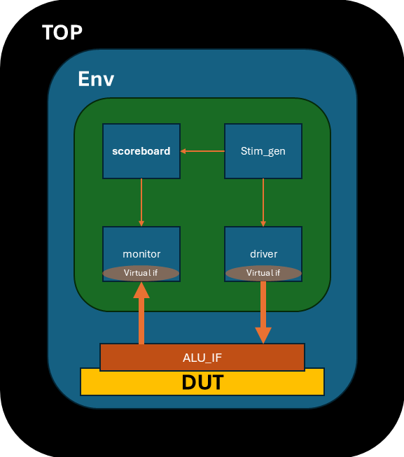

# ⚙️ ALU Verification Environment (SystemVerilog)



## 📖 Overview
This project implements a **SystemVerilog verification environment** for an Arithmetic Logic Unit (ALU).  
The environment uses **transaction-based stimulus, driver, monitor, scoreboard, coverage, and assertions** to validate ALU functionality under randomized inputs and corner-case scenarios.

---

## 🔌 ALU Interface
The ALU interface (`alu_if`) defines the DUT connections:

**Inputs**
- `reset` – system reset  
- `valid_in` – input valid flag  
- `a`, `b` – 4-bit operands  
- `cin` – carry-in  
- `ctl` – control signal (operation selector)

**Outputs**
- `valid_out` – output valid flag  
- `alu` – 4-bit result  
- `carry` – carry-out  
- `zero` – zero flag  

---

## 🧪 Verification Components

### 1. **Packet Class**
- Encapsulates ALU inputs/outputs.  
- Randomized with constraints on `reset` and `ctl`.  
- Each transaction is tagged with `pkt_num`.

### 2. **Stimulus Generator (`stim_gen`)**
- Randomizes packets.  
- Sends them to the driver via mailbox.  
- Drives 500 transactions by default (`no_of_trans`).

### 3. **Driver**
- Retrieves packets from stimulus mailbox.  
- Drives signals onto the ALU interface at `negedge clk`.  
- Triggers monitor sampling via `start_mon` event.

### 4. **Monitor**
- Samples DUT inputs/outputs at `posedge start_mon`.  
- Creates packet objects with observed values.  
- Sends packets to both scoreboard and coverage mailboxes.

### 5. **Scoreboard**
- Compares DUT outputs against reference outputs.  
- Tracks `correct` and `error` counts.  
- Displays mismatches with packet details.  
- (Optional) Golden model included for ALU operations.

### 6. **Coverage**
- Covergroup samples ALU transactions.  
- Coverpoints:
  - Operand `a` and `b`  
  - Control signal `ctl` (with illegal bins for invalid ops)  
  - ALU result (`alu`) with bins for zero, max, and others  
- Ensures functional coverage across all operations.

### 7. **Assertions (`sva`)**
- Example property:  
  - `valid_in |=> valid_out` (valid input must lead to valid output).  
- Assertions and cover properties bound to the top module.

### 8. **Test Environment (`test_env`)**
- Instantiates all components: stimulus, driver, monitor, scoreboard, coverage.  
- Uses mailboxes for communication.  
- Runs all tasks in parallel (`fork-join`).  

---

## ▶️ Simulation Flow
1. **Reset task** initializes DUT.  
2. **Stimulus** generates randomized transactions.  
3. **Driver** applies inputs to DUT.  
4. **Monitor** samples DUT behavior.  
5. **Scoreboard** checks correctness.  
6. **Coverage** collects functional coverage.  
7. **Assertions** validate protocol properties.  
8. **Report** prints error and correct counts.

---

## 📊 Coverage Goals
- **Functional coverage**: All ALU operations exercised.  
- **Assertion coverage**: Properties validated.  
- **Code coverage**: Achieved via QuestaSim reports.
  
---

## ▶️ Running the Simulation
1. Compile with QuestaSim:
   ```tcl
   vlog +define+SIM top.sv
   vsim -do run.do
   ```
2. Run simulation:
   ```tcl
   run -all
   ```
3. Generate coverage reports and check results.

---
